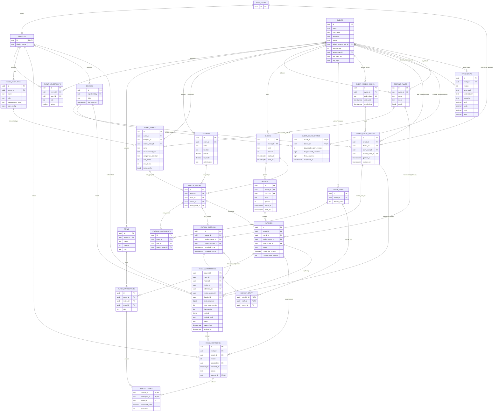
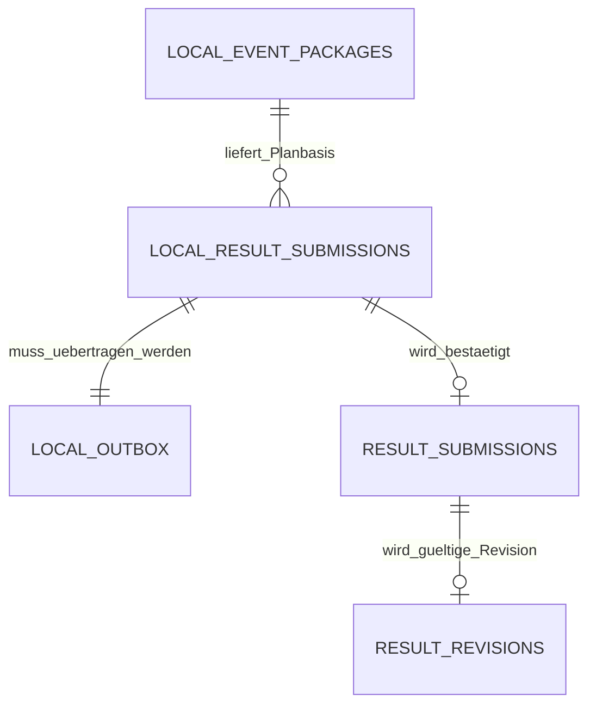
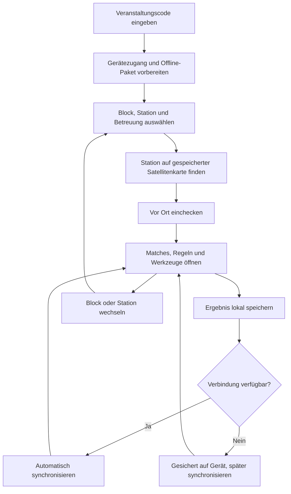

# Sporttag-App: ER-Modell und Datenkonzept

Stand: 20.09.2026 · Entwurf 3: Codezugang, Stationsbetreuung und Offline-Geländekarte

Grundlage: `sporttag-app-datenmodell-handover.md`. Die Anforderungen daraus dienen als fachlicher Kontext. Dieses Dokument konzipiert das Modell; es implementiert weder Anwendung noch Datenbank. Mit **Default** markierte Entscheidungen sind Vorschläge, keine bereits bestätigten Anforderungen.

Die verbindliche Frontend-Zielarchitektur steht in [frontend-architektur.md](frontend-architektur.md): gemeinsame Expo-Anwendung, gluestack-ui als Komponentenbasis, NativeWind für das Designsystem und native Navigation mit Expo Router. Diese Architektur ändert die hier beschriebenen Offline- und Datenintegritätsanforderungen nicht.

## 1. Modell im Überblick

Ein Sporttag ist eine abgeschlossene Veranstaltung. Teams, Stationen, Zeitplan, Spielkonfiguration und Ergebnisse gehören genau zu dieser Veranstaltung. Wiederverwendbare Spielvorlagen und Organisatoren-Accounts bestehen veranstaltungsübergreifend. Die App richtet sich an Stationsmanager und das Backoffice. Öffentliche Ansichten für Teilnehmer gehören nach der jüngsten Präzisierung nicht zum aktuellen App-Umfang.

Stationsmanager treten über einen gemeinsamen Veranstaltungscode bei, beispielsweise sechsstellig, und benötigen keinen persönlichen Account. Sie wählen eine Station und einen Block beziehungsweise die angezeigte Betreuung wie „Station 1 · Block 1 · Joel und Elias“. Namen sind planbare Betreuungspersonen, keine Logins. Mehrere Personen und Geräte können dieselbe Station betreuen. Das Backoffice ist bestätigt separat für Organisatoren geschützt.

Jede Station hat einen festen Standort mit Geo-Koordinaten. Eine vorbereitete Satellitenübersicht mit Stationspins wird offline mitgeliefert. Nach der Orientierung checken Stationsmanager manuell ein und sehen Matches, Regeln, Timer, Stoppuhr und Zähler. Für eine Hilfemeldung wird zunächst nur ein im Backoffice einstellbares ntfy-Topic vorgesehen.

Eine **Stationsbelegung** verbindet Station, Block und Veranstaltungsspiel. Ein **Match** verbindet diese Belegung mit einer Runde. Seine Teams stehen in einer Teilnahmetabelle. Ergebnisse werden pro Match versioniert und enthalten für jedes teilnehmende Team einen Ergebniswert. Tabellenpunkte entstehen daraus anhand einer festgelegten Wertungsregel.

Bestätigt: Spielpunkte unterscheiden sich stark je Spiel. Die Gesamtwertung basiert deshalb standardmäßig auf Sieg/Unentschieden/Niederlage, nicht auf der Summe der Spielpunkte. Der Gesamtsieg ergibt sich aus der Tabelle. Optional sind Matches mit mehreren oder allen Teams möglich, beispielsweise das „Kamelspiel“. Sie können am Ende oder in einer beliebigen Spielrunde stattfinden. Ein Abschlussspiel ist keine Voraussetzung. Im Backoffice wird für solche Matches entweder nur der Gewinner oder eine Folge von Platzierungen mit Punkten belohnt.

**Offline ist verpflichtend:** Nach einmaliger Vorbereitung muss der gesamte Sporttagsbetrieb ohne Internet funktionieren, auch über App-Abstürze und Neustarts hinweg. Ergebnisse werden zuerst dauerhaft lokal gespeichert. Sobald Internet verfügbar ist, werden sie automatisch zur zentralen Datenbank übertragen. Ein einziger abschließender Synchronisationsdurchlauf je Erfassungsgerät muss ebenfalls ausreichen. Echtzeitfunktionen sind eine Ergänzung und keine Voraussetzung.

Weitere Defaults: feste Teams ohne personenbezogene Teilnehmerverwaltung, manuelle Planung, zwei Teams in regulären Matches, eine Gesamtwertung und unmittelbare lokale Ergebnisbestätigung durch Spielleiter. Das Modell unterstützt ausdrücklich auch ein oder mehrere Teams pro Match. Bestätigt ist die freie Konfiguration der Tabellenpunkte im Backoffice; 3/1/0 ist lediglich ein vorbelegbarer Vorschlag.

## 2. ER-Diagramm

`||` bedeutet genau eins, `o|` null oder eins, `o{` null bis viele. Entwürfe dürfen zunächst unvollständig sein; strengere Mindestzahlen gelten beim Veröffentlichen oder Abschließen.

Die direkten Event-Beziehungen indirekter Kindtabellen sind im Diagramm zur Lesbarkeit nicht nochmals eingezeichnet. Ihr `event_id` wird durch zusammengesetzte Fremdschlüssel abgesichert.

## 3. Datenkatalog

Konventionen: Alle `id` sind UUID-Primärschlüssel, sofern anders angegeben. Fremdschlüssel sind UUID. `?` bedeutet nullable, alle anderen Angaben sind Pflichtfelder, sofern kein Default genannt ist. Veränderliche Stammdaten erhalten `created_at` und `updated_at` als `timestamptz`. Ergebnisrevisionen sind unveränderlich. Status und Typen sind `text` mit definierten CHECK-Wertemengen. Fachliche Pflichtprüfungen dürfen beim Entwurf teilweise erst zur Veröffentlichung greifen.

| Entität | Zweck, Attribute und Schlüssel |
|---|---|
| `events` | Veranstaltung: `name text`, `motto text?`, `event_date date`, `timezone text` (Default `Europe/Berlin`), `status` (`draft/published/running/finished/archived`), `default_scoring_rule_id? → scoring_rules`, `plan_version int` Default 1, `active_map_id? → event_maps`, `ntfy_base_url text?`, `ntfy_topic text?`. Wertungsregel und aktive Karte müssen vor Freigabe des Offline-Pakets gesetzt sein. ntfy optional; Topic und Basis-URL werden gemeinsam konfiguriert. |
| `profiles` | Nur persönliche Organisatorenprofile: `id` zugleich PK und FK zu `auth.users.id`, `display_name text`. Stationsmanager brauchen kein Profil. Zugangsdaten bleiben bei Auth. |
| `event_memberships` | Backoffice-Berechtigung: `event_id → events`, `user_id → profiles`, `role` zunächst ausschließlich `organizer`, `active boolean` Default true. UNIQUE `(event_id,user_id)`. Stationsbetreuung wird unabhängig davon geplant. |
| `game_templates` | Wiederverwendbare Vorlage: `owner_id → profiles`, `name`, `description`, `rules`, `referee_notes`, `materials` als Text; optionale Beschreibungstexte dürfen leer sein. `default_duration_seconds int?`, `measurement_type` (`outcome/number`), `unit text?`, `comparison_direction` (`higher/lower`), `min_teams int` und `max_teams int` Default 2, `allow_ties boolean`, `tools_config jsonb` Default `[]` mit validierten Definitionen für Timer, Stoppuhr und Zähler. Zunächst private Vorlagen des Erstellers. |
| `event_games` | Historisch eigenständige Spielkopie: `event_id`, `template_id? → game_templates`; alle fachlichen Vorlagenattribute als Kopie, `scoring_rule_id? → scoring_rules` als Überschreibung. Eine Vorlage kann mehrere Varianten in einem Sporttag erzeugen. Dauer ist nur Planungsrichtwert. |
| `teams` | Feste Teams: `event_id`, `name text`, `number int?`, `color text?`, `participant_count int?`. UNIQUE `(event_id,name)` und `(event_id,number)` für gesetzte Nummern. Keine Personennamen erforderlich. |
| `stations` | Fester physischer Ort: `event_id`, `name text`, `location text?`, `notes text?`, `latitude numeric(9,6)`, `longitude numeric(10,6)` in WGS84, `arrival_notes text?`. UNIQUE `(event_id,name)`. Koordinaten gelten über alle Blöcke des Events; kein `game_id`. |
| `scoring_rules` | Unveränderliche Regel nach Veröffentlichung: `event_id`, `name text`, `mode` (`win_draw_loss/raw_value/placement`), `config jsonb`. Konfiguration hat ein festes Schema pro Modus, keine frei ausführbaren Formeln. |
| `blocks` | Grobe Zeitstruktur: `event_id`, `name text`, `kind` (`play/break/final/special`), `position int`, `starts_at/ends_at timestamptz`. UNIQUE `(event_id,position)`. Ein Pausenblock hat keine Runden oder Belegungen. |
| `rounds` | Zeitslot im Block: `event_id`, `block_id → blocks`, `label text`, `position int`, `kind` (`play/break`), `starts_at/ends_at timestamptz`. UNIQUE `(block_id,position)`. Pausenrunden erlauben ausdrücklich benannte Pausen innerhalb eines Spielblocks und enthalten keine Matches. |
| `station_setups` | Spiel pro Station und Block: `event_id`, `block_id → blocks`, `station_id → stations`, `event_game_id → event_games`, `notes text?`. UNIQUE `(block_id,station_id)`. |
| `event_staff` | Planbare Betreuungsperson ohne Account: `event_id`, `display_name text`, `notes text?`. Keine E-Mail, kein Passwort, kein verpflichtender Auth-FK. Gleiche Namen sind erlaubt und werden in der Planung unterscheidbar beschriftet. |
| `station_assignments` | Geplante Betreuung: `event_id`, `staff_id → event_staff`, `station_setup_id → station_setups`. UNIQUE `(staff_id,station_setup_id)`. Joel und Elias sind zwei Zuordnungen derselben Belegung. Dies ist Einsatzplanung, keine individuelle Zugriffssperre. |
| `event_access_codes` | Serverinterner Zugangscode: `event_id`, `code_digest text` UNIQUE, `valid_until timestamptz`, `revoked_at timestamptz?`, `created_at`. Code als sechsstellige Zeichenfolge inklusive möglicher führender Nullen; nur der mit serverseitigem Geheimnis erzeugte Digest wird gespeichert. Ein aktiver Code pro Event, Rotation möglich. Clients können die Tabelle nicht auslesen. |
| `device_event_access` | Technischer Eventzugang: `event_id`, `device_id → devices`, `auth_user_id → auth.users`, `access_code_id? → event_access_codes`, `granted_at`, `revoked_at?`. Anonyme technische Auth-Identität statt persönlichem Stationsleiterkonto. Ein aktiver Zugang je `(event_id,device_id)`; Zugriff nur für die gebundene Auth-Identität. |
| `station_checkins` | Tatsächliche Übernahme: `id` schon offline erzeugt, `event_id`, `station_setup_id → station_setups`, `device_access_id → device_event_access`, `checked_in_at`, `checked_out_at?`, `received_at?`. Je Gerät höchstens ein lokal aktiver Check-in pro Event, mehrere Geräte an derselben Belegung erlaubt. Ortsnachweis ist nicht erforderlich. |
| `checkin_staff` | Angegebene Anwesende: PK `(checkin_id,staff_id)`, FKs zu Check-in und `event_staff`, zusätzlich `event_id`. Erlaubt Joel und Elias gemeinsam auf einem Gerät oder jeweils mit eigenem Gerät. Namen sind Selbstauskunft, keine verifizierte Identität. |
| `event_maps` | Offline-Kartenstand: `event_id`, `version int`, `asset_path text`, `content_hash text`, `mime_type text`, `width_px/height_px int`, `projection text` Default `EPSG:3857`, WGS84-Grenzen `north/south/east/west numeric`, `source_label text?`, `attribution text?`. UNIQUE `(event_id,version)`. Nordorientiertes, georeferenziertes Satellitenbild; Event referenziert den aktiven Stand. |
| `matches` | Konkrete Begegnung: `event_id`, `round_id → rounds`, `station_setup_id → station_setups`, `status` (`scheduled/ready/in_progress/completed/cancelled`), `scoring_rule_id? → scoring_rules`, `counts_for_ranking boolean` Default true, `notes text?`, `current_result_version int` Default 0. Regel wird bei Veröffentlichung verbindlich gesetzt. Planzeiten kommen aus der Runde; optionale `actual_started_at/actual_ended_at` erfassen tatsächliche Zeiten. |
| `match_participants` | n:m zwischen Matches und Teams: `event_id`, `match_id → matches`, `team_id → teams`, `slot int`. UNIQUE `(match_id,team_id)` und `(match_id,slot)`. Ein Slot ist nur Reihenfolge, kein neues Team. |
| `result_revisions` | Vollständiger zentral gültiger Ergebnisstand: `event_id`, `match_id → matches`, `version int`, `recorded_by? → profiles` nur bei Organisatoren, `recorded_at timestamptz` (Serverzeit), `reason text?`, `request_id → result_submissions.request_id` UNIQUE. UNIQUE `(match_id,version)`. Ab Version 2 ist ein Korrekturgrund erforderlich. Bei Stationsmanagern liefert die Abgabe Geräte-/Check-in-Kontext statt eines persönlichen Accounts. |
| `result_values` | Teamwert einer Revision: zusammengesetzter PK `(revision_id,participant_id)`, FK zu Revision und Matchteilnahme, zusätzlich `event_id`. `measured_value numeric(14,4)?`, `placement int?`. Bei `number` ist der Messwert Pflicht, die Platzierung wird abgeleitet; bei `outcome` wird ausschließlich die Platzierung gespeichert. |
| `devices` | Registriertes Erfassungsgerät: `registered_by? → profiles` nur bei Organisatoren, `label text`, `last_seen_at timestamptz?`. UUID je Installation; kein Hardware-Fingerprinting. Wird auch beim Codebeitritt ohne Profil angelegt. Geräte-ID dient der Zuordnung, nicht als Berechtigungsnachweis. |
| `event_device_states` | PK `(event_id,device_id)`, FKs zu Event und Gerät. `downloaded_plan_version int`, `last_reported_sequence bigint` Default 0, `final_sequence bigint?`, `reconciled_at timestamptz?`. Geräte werden vorab als erwartete Quellen registriert. Ein fehlendes Gerät wird beim Abschluss sichtbar. |
| `result_submissions` | Dauerhaftes Server-Eingangsjournal, PK `request_id uuid` bereits offline erzeugt. `event_id`, `match_id`, `device_id`, `submitted_by? → profiles` bei Organisatoren, `device_access_id? → device_event_access`, `checkin_id? → station_checkins`, `local_sequence bigint`, `base_result_version int`, `plan_version int`, `payload jsonb`, `payload_hash text`, `status` (`accepted/conflict/needs_review/resolved`), `captured_at` vom Gerät, `received_at` vom Server. UNIQUE `(event_id,device_id,local_sequence)`. Stationsabgaben verlangen Gerätezugang und passenden Check-in; Organisatorabgaben verlangen aktive Mitgliedschaft. Mindestens einer dieser Berechtigungswege muss vorliegen. Payload einschließlich ausgewählter Namensanzeige ist unveränderlich; Fachstatus ist serververwaltet. Optional `resolution_request_id? → result_submissions` dokumentiert die Konfliktauflösung. |

`result_values` muss zusätzlich garantieren, dass Revision und Teilnahme dasselbe Match betreffen. Das geschieht durch einen Constraint-Trigger oder einen zusätzlichen, zusammengesetzt abgesicherten `match_id`; ein einfacher Event-FK reicht dafür nicht.

## 4. Beziehungen und Modellierungsentscheidungen

**Veranstaltung und Vorlagen:** Ein Event hat jeweils 1:n Teams, Stationen, Spiele und Blöcke. Vorlage zu Veranstaltungsspiel ist 1:n, auf Spielseite optional. Die Kopie verhindert, dass geänderte Regeln aus 2027 rückwirkend Ergebnisse von 2026 verändern. Beim Kopieren eines Sporttags entstehen neue IDs; Ergebnisse und Berechtigungen werden nicht automatisch übernommen.

**Station, Block und Spiel:** Stationen und Blöcke bilden über `station_setups` eine n:m-Beziehung. Jede Belegung hat genau ein Veranstaltungsspiel. Dasselbe Spiel darf an mehreren Stationen gleichzeitig laufen. Ein Spielwechsel innerhalb eines Blocks erfordert im Kernmodell einen neuen Block.

**Runden und Matches:** Ein Block besitzt mehrere Runden; eine Spielrunde enthält null bis viele parallele Matches. Jedes Match nutzt genau eine Stationsbelegung aus demselben Block. Station und Spiel werden daraus abgeleitet und nicht als unabhängig änderbare Matchfelder gespeichert.

**Matches und Teams:** n:m über `match_participants`. Die Spielkonfiguration legt die zulässige Teilnehmerzahl fest. Ein Team darf in einer Runde höchstens ein nicht abgesagtes Match haben; es muss keines haben. Entwürfe dürfen noch unvollständige Paarungen besitzen, gestartete Matches nicht.

**Benutzer und Betreuung:** Organisatoren besitzen persönliche Profile und n:m-Mitgliedschaften in Events. Stationsmanager besitzen keine persönlichen Profile; ein Gerät erhält nach Codebeitritt einen Eventzugang. Die geplanten Personen stehen als `event_staff` n:m zu Stationsbelegungen. Tatsächliche Check-ins verbinden Gerätezugang und Belegung, ihre ausgewählten Personen stehen in `checkin_staff`. Planung, tatsächliche Anwesenheit und technischer Zugang werden somit unabhängig modelliert. Ein Stationswechsel braucht keinen neuen Account und keine zusätzliche Freigabe.

**Ergebnisse:** Match zu Ergebnisrevision ist 1:n. Der aktuelle gültige Stand ist genau die Revision mit `version = matches.current_result_version`, bei Version 0 gibt es noch kein Ergebnis. Jede gültige Revision enthält genau einen Ergebniswert für jede Matchteilnahme. Frühere Revisionen bleiben erhalten. Damit ist eine Ergebnishistorie vorhanden, ohne bereits sämtliche Planungsänderungen in ein allgemeines Audit-System zu verlagern.

**Offline-Abgaben:** Ein Match kann mehrere eingegangene Abgaben besitzen. Jede Abgabe erzeugt höchstens eine gültige Revision. Widersprüchliche Abgaben werden ebenfalls gespeichert, verändern aber zunächst nicht die Tabelle. Die serverseitige Speicherung einer Abgabe und deren fachliche Annahme sind zwei getrennte Zustände. Der lokale Speicher und dessen Warteschlange sind in Abschnitt 11 separat modelliert.

## 5. Ergebnis und Wertung

### Eingabeebene

Für den Kern genügen zwei Eingabeformen:

- `outcome`: Platzierungen, bei zwei Teams Sieg/Niederlage als 1/2 und Unentschieden als 1/1. Für mehrere Teams werden vollständige Platzierungen gespeichert.
- `number`: Ein Messwert je Team in einer festen Einheit, etwa Treffer, Sekunden oder Meter. `higher` oder `lower` entscheidet, welcher Wert besser ist. Zeiten werden beispielsweise stets in Sekunden gespeichert, unabhängig von der Anzeige.

Bei numerischen Gleichständen entstehen gemeinsame Plätze im Wettbewerbsrang: 1, 1, 3. `allow_ties=false` verhindert den Abschluss eines Gleichstands; zunächst muss nach einer festgelegten Spielregel ein eindeutiges Ergebnis vorliegen. Mehrere Versuche, Sätze oder unterschiedliche Messgrößen pro Spiel sind eine spätere Erweiterung, kein unstrukturiertes JSON-Ergebnis.

### Übersetzung in Tabellenpunkte

Bestätigter Standard: Zum Beispiel ergibt ein Sieg mit 3:2 bei Fähnchen klauen dieselben Tabellenpunkte wie ein Sieg mit 30:20 bei einem anderen Spiel. Spielpunkte bleiben für Anzeige und Nachvollziehbarkeit erhalten, beeinflussen aber nicht die Gewichtung des Sieges. Auch die rohe Punktedifferenz zwischen verschiedenen Spielen ist kein Standard-Tiebreaker.

| Modus | Beispielkonfiguration | Berechnung |
|---|---|---|
| `win_draw_loss` | `{"win":3,"draw":1,"loss":0}` | Nur zwei Teams; Ergebnisvergleich ergibt 3/0 oder 1/1. |
| `raw_value` | `{"factor":1}` | Optionale spätere Sonderregel, nicht Bestandteil der Standard-Gesamttabelle. Keine Vermischung verschiedener Spielpunkteskalen. |
| `placement` | `{"points_by_place":{"1":3,"2":2,"3":1},"unlisted_points":0,"tie_policy":"same_place"}` | Einstellbare Punkte je Platz, übrige Plätze explizit 0. Beispiel für ein großes Match, keine feste Vorgabe. |

Im Backoffice werden für den Sporttag die Punkte für Sieg, Unentschieden und Niederlage eingestellt. Für das Kamelspiel wird eine eigene Spielwertung gewählt: beispielsweise nur Platz 1 mit 3 Punkten, alle anderen 0; alternativ Top 3 mit etwa 3/2/1 Punkten, alle anderen 0. Die Werte für Platz 2 und 3 sind frei einstellbar; die genannten Zahlen sind Beispiele. Eine begrenzte Platzliste plus `unlisted_points` macht die Behandlung aller übrigen Teams ausdrücklich.

Ein „nur Gewinner“-Spiel benötigt nicht die vollständige Rangfolge der Verlierer: Platz 1 wird für den Gewinner, ein gemeinsamer Platz 2 für die übrigen Teams gespeichert. Bei Top-3-Punkten können alle Teams außerhalb der Top 3 einen gemeinsamen Platz 4 erhalten. Das gilt für erfasste Platzierungen; numerische Ergebnisse erzeugen weiterhin die vollständige Rangfolge. Die Gruppierung nicht weiter gewerteter Teams ist kein entscheidungspflichtiger Gleichstand: `allow_ties=false` betrifft bei solchen Eingaben die ausdrücklich ausgespielten Plätze. Bei Platzgleichheit ist die vorgeschlagene Regel „gleicher Platz, gleiche Punkte“ im Setup sichtbar. Wenn exakt drei Teams Punkte erhalten sollen, muss das Spiel eindeutige Plätze liefern oder eine Stichentscheidung festlegen.

Auswahl bei Veröffentlichung: Spielregel überschreibt Event-Default. Das Match speichert anschließend den aufgelösten Regel-FK. Individuelle Matchregeln sind zunächst keine Backoffice-Funktion. Das Feld fixiert die tatsächlich verwendete Regel.

Regeln und ergebnisrelevante Spielattribute werden nach Veröffentlichung gesperrt. Eine Änderung bereits gewerteter Regeln benötigt später einen ausdrücklichen, nachvollziehbaren Neuwertungsprozess. So ändern sich alte Ranglisten nicht unbemerkt.

Tabellenpunkte werden berechnet und nicht zusätzlich je Team gespeichert. Nur abgeschlossene, wertungsrelevante Matches mit gültiger aktueller Revision zählen. Abgesagte und offene Matches zählen nicht. Falls ein Mehrteamspiel vorgesehen ist, fließt es mit seiner im Setup festgelegten Platzierungsregel in dieselbe Tabelle ein. Ohne ein solches Spiel funktioniert die Tabelle unverändert. Es gibt keinen davon unabhängigen Final-Gesamtsieger. Eine höhere Gewichtung wird durch die Platzierungspunkte selbst eingestellt, ohne versteckten zusätzlichen Multiplikator.

Default für die Gesamtwertung: Summe der Tabellenpunkte absteigend; bei Gleichstand geteilter Rang. Siege/Unentschieden/Niederlagen werden nur für Zweiermatches ausgewiesen. Rohpunkte und Gegenpunkte werden pro Spiel/Einheit ausgewertet; Meter, Sekunden und Treffer dürfen nicht zu einer scheinbar sinnvollen Gesamtsumme vermischt werden.

### Speichern und korrigieren

Zuerst speichert eine lokale Transaktion Ergebnisabgabe und Übertragungsauftrag gemeinsam. Erst nach erfolgreichem Commit zeigt die App „Auf diesem Gerät gespeichert“. Dafür braucht sie weder eine Serververbindung noch eine erfolgreiche Token-Erneuerung. Die Details der Wiederherstellung und Synchronisation stehen in Abschnitt 11.

Bei Synchronisation prüft der Server Identität und Eventzugriff und persistiert die Abgabe im Eingangsjournal. Unter einer Matchsperre prüft er Planbezug, Berechtigung, Matchstatus und erwartete Ergebnisversion. Eine passende Abgabe erzeugt atomar Revision plus alle Teamwerte, aktuelle Version und abgeschlossenen Matchstatus. Eine widersprüchliche oder fachlich gesperrte Abgabe bleibt als `conflict/needs_review` erhalten. Wiederholte Requests mit derselben `request_id` liefern den bestehenden Empfangsbeleg; Wiederverwendung mit abweichendem Inhalt wird abgelehnt.

Zwei gleichzeitige Bearbeiter überschreiben sich somit nicht stillschweigend. Stationsmanager dürfen nach selbst gewähltem Check-in Ergebnisse der entsprechenden Belegung speichern und Korrekturvorschläge offline sichern. Default: Zentrale Korrekturen bestätigt ein Organisator mit Begründung. Lokal gespeicherte, noch unbestätigte Ergebnisse sind sichtbar als ausstehend gekennzeichnet. Die zentrale Tabelle zählt nur serverseitig angenommene Revisionen. Für konfliktfreie Erstabgaben gibt es keine zusätzliche Freigabestufe.

## 6. Zeitplan, Pausen und optionale Mehrteamspiele

Planzeiten werden als `timestamptz` gespeichert und in `events.timezone` dargestellt. `event_date` bezeichnet den Veranstaltungstag. Intervalle sind halboffen `[Start, Ende)`, direkt anschließende Slots sind erlaubt.

Allgemeine Pausen zwischen Blöcken sind `blocks.kind=break`. Pausen innerhalb eines Blocks sind `rounds.kind=break`. Damit ist kein zusätzliches generisches Kalendersystem nötig. Eine Lücke ohne Match bedeutet für das betreffende Team Freizeit, kein eigenes Pausenobjekt.

Ein Teamspielplan im Backoffice entsteht aus Team → Matchteilnahme → Match → Runde sowie Stationsbelegung → Station/Spiel. Globale Pausen werden ergänzt. Die Stationsansicht filtert dieselben Matches nach Belegung; laufende Matches werden über Status erkannt, geplante über Runde und Uhrzeit. Es gibt keine zweite Spielplantabelle und keine öffentliche Teilnehmer-App im aktuellen Umfang.

Ein optionales Mehrteamspiel verwendet ein normales Match in einer Spielrunde, eine gemeinsame Station, etwa „große Wiese“, und eine Teilnahme pro Team. Es benötigt weder einen Sonderblock noch einen Platz am Ende des Tages. Bei sechs Teams entstehen sechs `match_participants` und sechs Werte je Ergebnisrevision. Eine neue Matchtabelle ist dafür nicht nötig. Es gibt keine Pflicht, ein solches Match anzulegen.

Die zugehörige Spielkonfiguration erlaubt die tatsächliche Teamzahl. Ihre Platzierungsregel überschreibt den Zweiermatch-Default. Bestätigte Optionen sind Gewinnerpunkte oder Punkte für die Top 3, jeweils im Backoffice konfigurierbar. Beides verwendet den Modus `placement`. Rohpunkte dieses Spiels werden nicht automatisch zur Tabelle addiert. Ohne vollständig konfigurierte Mehrteam-Wertung darf das Match nicht als wertungsrelevant veröffentlicht werden.

Der Gesamtsieger wird über die Tabelle ermittelt. Eine KO-Struktur oder automatische Finalqualifikation gehört damit derzeit nicht zum Kern. Der historische Typ `final` kann bei Bedarf als Zeitblocklabel bleiben, hat aber keine eigene Siegerlogik.

## 7. Integrität und Prüfungen

### Direkt durch Schlüssel und CHECKs

- Alle Veranstaltungsreferenzen bleiben im selben Event: Kindtabellen referenzieren `(event_id,id)` des Elternobjekts; Eltern erhalten den entsprechenden UNIQUE-Schlüssel. Dies gilt auch für Default- und Spielwertungsregeln, aktive Karte und Gerätezugänge.
- Zeiten: Start < Ende; Positionen und Slots > 0; `1 <= min_teams <= max_teams`; Dauer und Teamgröße, falls vorhanden, > 0.
- Ein Spiel je Station/Block, eindeutige Mitgliedschaften und Matchteilnahmen gemäß Datenkatalog.
- Höchstens ein nicht abgesagtes Match je `(round_id,station_setup_id)` durch partiellen Unique-Index.
- Keine NaN-/Infinity-Messwerte; Zahlenformat, Einheit und erlaubter Wertebereich werden passend zur Spielkonfiguration geprüft. Null bedeutet fehlend und niemals automatisch null Punkte.
- Stationskoordinaten müssen gültige WGS84-Werte und innerhalb des gewählten Kartenausschnitts sein. Für die Web-Mercator-Übersicht sind Breitengrade auf deren darstellbaren Bereich begrenzt. Kartenbreite/-höhe > 0, Süd < Nord und West < Ost; ein Ausschnitt über die Datumsgrenze ist für diesen Anwendungsfall nicht erforderlich.
- Check-in, Gerätezugang, ausgewählte Personen und Match müssen zum selben Event gehören; ein referenzierter Check-in muss dieselbe Stationsbelegung wie das Match haben. Alle Querreferenzen werden zusammengesetzt oder transaktional geprüft.
- Check-ins verschiedener Geräte dürfen dieselbe Belegung nutzen. Ein Check-out erfolgt nicht durch Löschen; das Ergebnis behält seinen Erfassungskontext.

### Transaktionale Prüfungen / Constraint-Trigger

- Runde liegt innerhalb ihres Blocks; Blöcke eines Events und Runden desselben Blocks überschneiden sich nicht. Globale Pausen schließen Spielbetrieb aus.
- Runde und Stationsbelegung des Matches liegen im selben Block. Pausen enthalten keine Matches.
- Team wird nicht doppelt in einer Runde eingeplant. Eine Prüfung allein im Client oder ein ungesperrtes SELECT vor INSERT ist hierfür nicht ausreichend; Schreiboperationen werden je Event serialisiert oder mit passenden Datenbanksperren abgesichert.
- Veröffentlichung verlangt vollständige Paarungen, zulässige Teilnehmerzahlen und kompatible Wertungsregeln. Die Zweierregel `win_draw_loss` darf nicht auf ein Mehrteamspiel angewendet werden. Ein Abschlussspiel wird nicht verlangt.
- Bei Matchstart sind alle Teams bekannt. Bei Ergebnisabschluss liegt genau ein gültiger Wert pro Teilnahme vor; Platzierungen und Gleichstände passen zu Spielregeln.
- Teilnehmer, Belegung und ergebnisrelevante Konfiguration eines Matches sind nach Start gesperrt. Ein abgeschlossenes Match wird nicht durch Überschreiben neu geplant.
- Zeitplanänderungen prüfen betroffene Kinder erneut, nicht nur das veränderte Objekt. Nach Veranstaltungsbeginn erfolgen sie ausschließlich durch Organisatoren.
- Statusübergänge werden lokal und serverseitig geprüft: `scheduled → ready → in_progress → completed`, Abbruch vor Abschluss zu `cancelled`. Da Zwischenschritte offline stattfinden, darf eine vollständige autorisierte Ergebnisabgabe serverseitig auch `scheduled → completed` atomar durchführen. Abgesagte Matches werden nicht automatisch reaktiviert. Korrektur erzeugt eine neue Revision bei unverändert `completed`.

### Löschung und Aufbewahrung

Entwürfe dürfen kontrolliert gelöscht werden. Sobald Ergebnisse vorhanden sind, wird die Veranstaltung archiviert; Teams, Spiele, Matches und Regeln werden nicht kaskadierend entfernt. Verwendete Vorlagen werden archiviert oder deren optionale Herkunftsreferenz wird gelöst. Entfernte Benutzerkonten dürfen Ergebnisse nicht mitlöschen: Autor-FK wird nullable, Historie bleibt erhalten; Vorlagenbesitz muss zuvor übertragen oder die Vorlage entfernt werden. Eine konkrete Aufbewahrungsfrist ist fachlich noch festzulegen.

## 8. Supabase und Zugriffskonzept

Das Modell verwendet PostgreSQL-Standardmittel: UUID, relationale Fremdschlüssel, Constraints und Transaktionen. Persönliche Auth-Accounts sind für Organisatoren vorgesehen. Für Stationsgeräte wird technisch eine anonyme Supabase-Sitzung vorgeschlagen: ohne Registrierung, E-Mail oder Passwort im Nutzerflow. Supabase legt dafür intern einen anonymen Auth-Datensatz an; dieser ist kein persönlicher Account von Joel oder Elias. Erst das Einlösen des Veranstaltungscodes erteilt Eventrechte. [Supabase: Anonymous Sign-Ins](https://supabase.com/docs/guides/auth/auth-anonymous)

| Daten / Aktion | Organisator des Events | Stationsgerät mit Eventcode-Zugang | Ohne Eventzugang |
|---|---|---|---|
| Teams, Ablauf, Karte, Ergebnisse | lesen und planen | für eigenes Event lesen | kein Zugriff |
| Planung und Wertungsregeln | im zulässigen Status ändern | nicht ändern | kein Zugriff |
| Station/Block und angezeigte Betreuung wählen | ja | selbst auswählen und einchecken | kein Zugriff |
| Erstes Ergebnis | speichern | gewählte Station/Block nach Check-in | kein Zugriff |
| Ergebniskorrektur und Historie | lesen und korrigieren | eigene aktuelle Ergebnisse lesen | kein Zugriff |
| Einsatzplanung, Codes und ntfy-Konfiguration | verwalten | Plan lesen, Konfiguration nicht ändern | kein Zugriff |
| Spielvorlagen | eigene verwalten, Eventkopien nutzen | Eventkopien lesen | kein Zugriff |

RLS wird auf allen über die API erreichbaren Tabellen aktiviert. Organisatorenrechte folgen aus aktiven `event_memberships`. Stationszugriff folgt aus `device_event_access.auth_user_id = auth.uid()` mit passendem Event und ohne Widerruf. Die Rolle `authenticated` allein genügt nicht, da auch anonyme Auth-Sitzungen diese Rolle erhalten. Stationspersonen und Check-ins vergeben keine Backoffice-Rechte. Eventanlage plus erste Organisatoren-Mitgliedschaft erfolgen atomar über einen kontrollierten Servervorgang. [Supabase: Row Level Security](https://supabase.com/docs/guides/database/postgres/row-level-security)

Der Codebeitritt läuft über einen begrenzten Server-Endpunkt: sechsstelligen Code serverseitig prüfen, Versuchsraten begrenzen, Event und Gültigkeit prüfen, Gerätezugang ausstellen. Für die geringe Codeentropie wird ein serverseitig geheimnisgebundener Digest verwendet; keine ungeschützte Liste mit Code-Hashes für Clients. Aktive Codes identifizieren das Event eindeutig. Im Backoffice wird ein neuer Code einmal angezeigt und kann anschließend ersetzt werden. Das Gerät speichert die erhaltene Sitzung, nicht den Veranstaltungscode als dauerhaftes Passwort. Ein rotierter Code verhindert neue Beitritte mit dem alten Code; bestehende Gerätezugänge werden separat widerrufen.

Selbstauswahl ist ausdrücklich erwünscht: Ein eingelassenes Stationsgerät darf im Event die passende Belegung und angezeigte Betreuung auswählen, ohne individuelle Freischaltung. Namen im Verlauf sind Selbstauskunft. Technisch nachvollziehbar bleiben Gerät, Zugang, Check-in, Planstand und Abgabe; eine persönliche Identitätsprüfung wird nicht behauptet.

Ergebnisrevisionen und Wertzeilen sind für Clients nicht direkt schreibbar. Ein kontrollierter RPC bildet die Ergebnistransaktion einschließlich noch nicht synchronisiertem Check-in ab. Falls dafür erhöhte Datenbankrechte erforderlich sind, braucht die Funktion explizite Prüfungen des Gerätezugangs oder der Organisatorenmitgliedschaft, einen festen `search_path` und eng begrenzte EXECUTE-Rechte. Service-Role-Schlüssel bleiben serverseitig.

Für Spielplan- und Ranglistenviews ist `security_invoker=true` auf unterstützten PostgreSQL-Versionen vorzusehen. Karten und Medien in Supabase Storage werden über den Eventzugang freigegeben und als vollständige lokale Dateien heruntergeladen; eine später ablaufende Download-URL darf die Offline-Karte nicht unbrauchbar machen. Öffentliche Endpunkte oder ein `public_enabled`-Feld sind im aktuellen Entwurf nicht erforderlich. [Supabase: Views und RLS](https://supabase.com/docs/guides/database/postgres/row-level-security#views-and-rls)

Realtime kann Änderungen der Matches abonnieren. Nach einer neuen Ergebnisversion lädt der Client aktuelle Ergebnisse und Rangliste erneut. Berechnete Views werden nicht wie Tabellen als eigene Änderungsquelle behandelt. Nach Verbindungsabbrüchen erfolgt ein vollständiger Neuabruf; Realtime ersetzt keine Offline-Synchronisation. [Supabase: Postgres Changes](https://supabase.com/docs/guides/realtime/postgres-changes)

Wichtige Indexzugriffe: Mitgliedschaft `(user_id,event_id)`, Gerätezugang `(auth_user_id,event_id)`, Betreuung `(staff_id,station_setup_id)`, Check-in `(device_access_id,station_setup_id)`, Teamteilnahme `(team_id,match_id)`, Matches `(event_id,round_id)` und `(station_setup_id,round_id)`, Revisionen `(match_id,version)`. Vorhandene Unique-Indizes werden genutzt, nicht doppelt angelegt. Für die erwartete Sporttagsgröße genügen dynamische Aggregationen; materialisierte Ranglisten sind zunächst nicht nötig.

## 9. Beispiel zur fachlichen Kontrolle

Sporttag 2026 hat sechs Teams und drei Stationen. Block 1 enthält drei Spielrunden. Station 1 ist in diesem Block mit Brennball belegt, im zweiten Block mit einem anderen Spiel.

Runde 1 hat an Station 1 das Match Team 1 gegen Team 2, an Station 2 Team 3 gegen Team 4 und an Station 3 Team 5 gegen Team 6. Brennball verwendet numerische Scores mit `higher` und die 3/1/0-Regel. Version 1 enthält 18 und 12; die Tabelle ergibt 3 Punkte für Team 1 und 0 für Team 2. Eine Korrektur auf 18 und 18 erzeugt Version 2: Beide erhalten nun 1 Punkt. Version 1 bleibt nachvollziehbar, zählt aber nicht zusätzlich.

Nach Block 1 folgt ein Pausenblock. Am Ende kann das Kamelspiel mit allen sechs Teams stattfinden. Seine sechs Ergebnisse werden zusammen gespeichert. Bei beispielhaft konfigurierten 3/2/1 Platzierungspunkten erhalten die ersten drei Teams diese Tabellenpunkte, die anderen 0. Diese werden zu den Tabellenpunkten aus den bisherigen Matches addiert.

Vor einer Implementierungsfreigabe sind insbesondere folgende Datenbanktests erforderlich: Event-fremde FKs ablehnen; Doppelbelegung und Teamkonflikte auch bei parallelen Requests verhindern; Spielwechsel zwischen Blöcken zulassen; Ergebnisretry idempotent behandeln; konkurrierende Korrektur zurückweisen; Rangliste nach Revision korrekt berechnen; unerlaubte RLS-Zugriffe verhindern. Dies sind geplante Abnahmetests, noch keine ausgeführten Implementierungstests.

## 10. Offene Entscheidungen und empfohlene Defaults

| Frage | Vorgeschlagener Default / Konsequenz |
|---|---|
| Einzelne Teilnehmer speichern? | Nein; nur Team und optionale Größe. Personen und Teammitgliedschaften erst bei konkretem Bedarf. |
| Teams während des Tags verändern? | Identität und Zusammensetzung bleiben fest; reine Anzeigenamen darf der Organisator korrigieren. |
| Einzelteam- oder Mehrteamspiele? | Optionale Mehrteamspiele bestätigt, auch mit allen Teams; keine Pflicht zum Abschlussspiel. Reguläre Matches typischerweise zwei Teams. |
| Spiele wiederholen oder parallel betreiben? | Beides erlaubt. Jede wertungsrelevante Wiederholung zählt; Anzahl und Fairness werden bei Planung geprüft. |
| Spielleiterwechsel? | Pro Block, mehrere Personen möglich. Wechsel innerhalb einer Runde ist noch nicht modelliert. |
| Historie/Audit? | Ergebnisrevisionen einschließlich Autor, Zeitpunkt und Korrekturgrund; vollständiges Planungs-Audit später. |
| Accounts für Stationsmanager? | Bestätigt: keine persönlichen Accounts, gemeinsamer Veranstaltungscode und technische Gerätesitzung. |
| Öffentliche Pläne und Ergebnisse? | Aus dem App-Umfang herausgenommen. Die App dient Stationsmanagement und Backoffice. |
| Backoffice-Zugang? | Bestätigt separat geschützt über Organisatoren-Accounts. |
| Geplante Personen und Check-in? | Mehrere Personen pro Station/Block; direkte Auswahl und manueller Check-in ohne persönliche Anmeldung. |
| Stationskarte? | Feste Geo-Koordinaten je Station; Satellitenübersicht mit Pins vollständig offline vorhalten. |
| Hilfe-Funktion? | Zunächst nur im Backoffice konfigurierbares ntfy-Topic; Versand ist verbindungsabhängig. |
| Live-Rangliste? | Ja, sobald Erfassungsgeräte synchronisieren. Letzter Aktualisierungszeitpunkt und Vollständigkeit bleiben sichtbar. |
| Mehrere Wertungskategorien/Gruppen? | Eine Gesamtwertung; Kategorien, Gruppenphasen und getrennte Tabellen erst bei bestätigtem Bedarf. |
| Finalpaarungen automatisch? | Aktuell kein Bedarf; optionale Mehrteamspiele werden wie andere Matches geplant. |
| Wer ist Gesamtsieger? | Bestätigt: die Tabelle entscheidet, mit oder ohne Mehrteamspiel. Falls vorgesehen, sind dessen Gewinner-/Top-3-Punkte im Setup einstellbar. |
| Automatischer Spielplan? | Zunächst manuell. Ein späterer Generator erzeugt dieselben Matches und Teilnehmer. |
| Ergebnisbestätigung? | Lokale Sicherung sofort; zentrale Wertung nach Serverannahme. Konflikte und Korrekturen durch Organisator. |
| Offline? | Verpflichtender Kern; vollständiger Betrieb nach Vorbereitung ohne Netz, späterer Abgleich aller Geräte. Siehe Abschnitt 11. |
| Konkrete Tabellenpunkte? | Bestätigt: im Backoffice einstellbar, 3/1/0 lediglich Vorbelegung. Optionale Mehrteamspiele mit eigener Platzierungstabelle. |
| Gleichstand in Gesamtwertung? | Geteilter Rang. Keine zufällige Entscheidung oder Vermischung inkompatibler Rohwerte. |

Die Punktevergabe wird pro Veranstaltung im Setup entschieden, nicht im Programm festgeschrieben. Noch als Vorschlag gelten die Gleichstandsbehandlung, ausschließlich durch Organisatoren bestätigte Korrekturen und die bevorzugte Nutzung nativer Apps für die zuverlässige Offline-Erfassung.

## 11. Offline-Datenkonzept und Ergebnissicherung

### 11.1 Verbindlicher Ablauf und Grenzen

Vor der Abfahrt werden App, einmaliger Codebeitritt, Gerätezugang und vollständiges Veranstaltungspaket eingerichtet. Das Paket enthält Plan, Teams, Stationen, Betreuungsliste, Spielregeln, Wertung, Werkzeugkonfiguration und das vollständige Satellitenbild. Ein Prüfschritt bestätigt, dass dieses Gerät den Sporttag vollständig offline öffnen kann. Die konkrete Station und die anwesenden Namen können anschließend vor Ort offline gewählt werden. Auf einem unvorbereiteten Gerät kann ein sechsstelliger Code allein ohne Verbindung weder den Server prüfen noch die Veranstaltung herunterladen. Eine lokale Paketübergabe samt separat vorbereitetem Gerätezugang wäre ein zusätzlicher Bereitstellungsweg, nicht durch die Codeeingabe automatisch gelöst.

Danach funktionieren Spielplan, Regeln, stationsbezogene Werkzeuge, Start/Abschluss von Matches, Ergebniseingabe, Korrekturvorschläge und lokal verfügbare Auswertung ohne Netz. Der Startbildschirm darf diese Funktionen weder hinter einer Online-Abfrage noch hinter einer frischen Token-Erneuerung sperren. Die vorbereitete lokale Identität erlaubt die Offline-Erfassung; sie ersetzt keine serverseitige Autorisierung beim späteren Upload.

Die lokal bestätigte Speicherung muss einen App-Absturz, erzwungenes Beenden, Geräteneustart und tagelange Netzlosigkeit überstehen. Ein späterer App-Start setzt die Übertragung fort. Ein verlorenes/defektes Gerät, gelöschte App-Daten oder eine Deinstallation vor jeder weiteren Kopie können dagegen die einzige Datenkopie vernichten. Dafür ist eine zweite Kopie auf einem anderen Gerät erforderlich; ein absoluter Schutz durch eine einzelne lokale Datenbank wäre ein falsches Versprechen.

Die zentrale Rangliste im Backoffice enthält nur bereits übertragene Daten. Ohne Netz zwischen Geräten kann kein Handy die neuen Ergebnisse anderer Stationen kennen. Die Anzeige nennt den Datenstand und „vorläufig“, solange der Abschlussabgleich fehlt. Die eigene Offline-Auswertung verwendet heruntergeladene Ergebnisse plus lokale Abgaben, ersetzt je Match höchstens einen Stand und zählt niemals beide Versionen. Bei Konflikten werden vorläufige Werte gesondert markiert.

### 11.2 Lokaler Speicher

Empfehlung: Für die kritische Erfassung die native iOS-/Android-App mit SQLite verwenden. Expo SQLite bietet persistenten Speicher über App-Neustarts hinweg. Browser-Erfassung ist separat zu qualifizieren: Der aktuelle Web-Support von Expo SQLite ist als Alpha dokumentiert. Für Offline-Backoffice im Browser sind eine vorab geladene App-Hülle und persistierte Daten nötig. Gleichwertige Schreib-Dauerhaftigkeit im Browser wird nicht ungeprüft zugesagt. [Expo SQLite](https://docs.expo.dev/versions/latest/sdk/sqlite/)

Das lokale Modell besteht aus einer lesbaren Eventkopie und einem unabhängigen Schreibjournal. Die Eventkopie darf aktualisiert oder neu aufgebaut werden; noch nicht abgeglichene Schreibdaten dürfen dadurch niemals verschwinden.

| Lokale Tabelle | Inhalt und Integrität |
|---|---|
| `local_event_packages` | PK `event_id`, `plan_version`, `schema_version`, `downloaded_at`, `verified_at`, `content_hash`; dazu atomar aktivierte relationale Eventkopien und lokal gespeicherte Medien. Ein abgebrochener Download ersetzt nicht das letzte vollständige Paket. |
| `local_result_drafts` | PK `match_id` innerhalb des gespeicherten Events, Eingabewerte, `updated_at`, `draft_version`. Automatisches lokales Sichern der Eingabe; die UI unterscheidet ungespeicherte Eingabe und bestätigten Entwurf. |
| `local_result_submissions` | PK `request_id`, `event_id`, `match_id`, `device_id`, `device_access_id`, `checkin_id`, `local_sequence`, angegebene Betreuungspersonen als Snapshot, `captured_at`, `plan_version`, `base_result_version`, vollständiger unveränderlicher `payload`, `payload_hash`; optional `supersedes_request_id` für einen Korrekturvorschlag. UUID wird einmal erzeugt und für jeden Retry beibehalten. Organisatorabgaben führen stattdessen den persönlichen Autor. |
| `local_outbox` | PK/FK `request_id → local_result_submissions`, `state` (`pending/sending/received`), `attempt_count`, `next_attempt_at`, `last_error`, optionaler `receipt`. Pro Abgabe genau ein Übertragungsauftrag. Fachstatus aus dem Empfangsbeleg bleibt davon getrennt. |
| `local_sync_state` | PK `event_id`, `device_id`, lückenlos vergebene nächste Sequenz, `last_download_at`, optionale Abschlussmeldung. Sequenz wird in derselben Transaktion wie die Abgabe erhöht; nur Ergebnisabgaben verbrauchen diese Sequenz. |
| `local_station_checkins` / `local_checkin_staff` | Lokale Entsprechungen der Check-in-Tabellen mit UUID, Belegung, Gerätezugang, Namen und Ein-/Auscheckzeit. Unabhängig vom Ergebnis speicherbar und später idempotent abgleichbar. Bei Ergebnissen wird ihr Check-in-Snapshot mitgesendet, damit ein fehlender vorheriger Upload keine Abgabe blockiert. |
| `local_tool_state` | PK `id`, Event/Spiel/optionaler Matchbezug, `tool_key`, `kind`, Zustand und Zeitpunkt. Timer-/Stoppuhrzustand, Zählerstand und gegebenenfalls Rundenzeiten werden lokal wiederhergestellt; keine zentrale Synchronisierung erforderlich. |
| `local_help_attempts` | PK `request_id`, Event-/Stationskontext, Nachricht, Zeitpunkt, `status` (`not_sent/sending/accepted_by_ntfy/unknown/failed/cancelled`). Separat von der Ergebnis-Outbox; bei Unsicherheit oder Offline-Betrieb keine automatische verspätete Alarmwiederholung. |

Die letzte Beziehung zwischen lokalem und zentralem Speicher ist logisch über dieselbe `request_id` verknüpft; es gibt keinen physischen Fremdschlüssel über das Netzwerk. Die 1:1-Beziehung zwischen Abgabe und Outbox wird durch gemeinsame Transaktion und Validierung erzwungen.

Beim Bestätigen werden sämtliche Teamwerte, die unveränderliche Abgabe, Sequenznummer und Outbox-Eintrag in **einer lokalen Transaktion** gespeichert. Erst nach erfolgreichem Commit zeigt die App die Bestätigung. Fehlschlag durch vollen Speicher oder Schreibfehler bleibt sichtbar; die App darf dann keinen Erfolg anzeigen. Lokale Transaktionen schützen vor halben Ergebnissen; SQLite dokumentiert dazu atomare Commits und deren Betriebssystem-/Hardwareannahmen. [SQLite: Atomic Commit](https://www.sqlite.org/atomiccommit.html)

Für die Umsetzung werden WAL, aktivierte Fremdschlüssel und ein auf Dauerhaftigkeit ausgelegter Synchronisationsmodus, beispielsweise `synchronous=FULL`, auf Zielgeräten geprüft. Migrationen und Wiederherstellung dürfen die Outbox niemals durch Löschen der Datenbank ersetzen. Ein Log-out sperrt die Datenansicht, löscht aber keine noch nicht abgeglichenen Abgaben. Ein Konto-/Gerätewechsel benötigt einen ausdrücklichen Übergabe- oder Wiederherstellungspfad.

### 11.3 Synchronisationsprotokoll

1. **Lokal sichern:** Abgabe und Auftrag gemeinsam committen. Online und offline benutzen genau denselben Schreibpfad.
2. **Übertragung versuchen:** Nach jeder Speicherung, bei App-Start, Rückkehr in den Vordergrund, wieder verfügbarer Verbindung und manuellem „Jetzt synchronisieren“. Bei Netz-/Serverfehlern mit wachsendem Abstand und zufälliger Streuung wiederholen. Keine endgültige Löschung nach einer Anzahl Fehlversuche.
3. **Sitzung prüfen:** Abgelaufene technische Sitzung bei bestehender Verbindung erneuern; bei verlorener Sitzung ist erneuter Codebeitritt beziehungsweise organisierte Gerätewiederherstellung nötig. Ein neuer anonymer Auth-Datensatz übernimmt keine alten Gerätezugänge allein aufgrund derselben behaupteten Geräte-ID. Solange dies nicht geklärt ist, bleiben Eingaben und Abgaben lokal erhalten. Organisatoren können sich separat wieder anmelden.
4. **Idempotent empfangen:** Server bindet Zugriff an die technische Sitzung und `device_event_access` beziehungsweise die Organisatorenmitgliedschaft. `request_id` plus kanonischer Inhalt verhindern doppelte Speicherung. Ausgewählte Namen sind Selbstauskunft. Ein Hash identifiziert Inhalt, beweist aber keine persönliche Autorenschaft. Ein mitgesendeter Check-in wird vor der Abgabe in derselben Transaktion geprüft und bei Bedarf angelegt.
5. **Journal und Wertung:** Innerhalb einer Transaktion wird die Abgabe dauerhaft gespeichert und entweder unter Matchsperre angewendet oder mit Konflikt-/Prüfstatus versehen. Nur `accepted` erzeugt die gültige Ergebnisrevision. Unberechtigte Requests erhalten keine Schreibrechte; ihre Originaldaten bleiben lokal für eine Wiederherstellung durch den Organisator erhalten.
6. **Empfang bestätigen:** Server liefert `request_id`, serverseitig überprüften Inhaltshash, Fachstatus und gegebenenfalls Revisionsnummer. Erst nach Prüfung und lokalem Commit dieses Belegs wird die Outbox als `received` markiert. Timeout bedeutet „Empfang unbekannt“ und führt zum Retry mit derselben ID.
7. **Stand laden:** Anschließend aktuelle Eventdaten und Ergebnisse in einem konsistenten Server-Snapshot abrufen und atomar in die lokale Lesekopie übernehmen. Lokale unbestätigte Abgaben bleiben separat erhalten. Für die geringe Datenmenge ist ein kompletter Eventabruf robuster als ein zunächst selbst entwickeltes Delta-Protokoll; keine Synchronisierung allein anhand von Gerätezeitstempeln.

Die App zeigt verständliche Zustände: **„Auf Gerät gespeichert“**, **„Übertragen“**, **„Klärung nötig“**. „Übertragen“ allein bedeutet bei einer Konfliktabgabe nicht „in der Tabelle gewertet“.

Nach einem Absturz werden zurückgebliebene `sending`-Aufträge erneut versucht. Ein Servercommit vor dem Absturz, dessen Antwort nie ankam, erzeugt beim Retry keine zweite Revision. Serverseitig bestätigte Originalabgaben bleiben zunächst auch lokal erhalten; Bereinigung erfolgt erst nach finalem Abgleich und festgelegter Aufbewahrung.

Hintergrundsynchronisation ist eine zusätzliche Gelegenheit. Das Betriebssystem entscheidet über die Ausführung; nach einem erzwungenen App-Ende kann sie ausbleiben. Verlässlich zugesagt wird deshalb das Wiederaufnehmen beim nächsten App-Start mit Verbindung, nicht ein Upload aus einer dauerhaft geschlossenen App. [Expo BackgroundTask](https://docs.expo.dev/versions/latest/sdk/background-task/)

### 11.4 Konflikte, Offline-Korrekturen und Planänderungen

Default: Je Match wird organisatorisch ein primär erfassendes Gerät vereinbart, mehrere berechtigte Geräte bleiben technisch möglich. Bei zwei widersprüchlichen Offline-Ergebnissen gewinnt nicht stillschweigend die spätere Geräteuhr. Der Server nimmt höchstens eine Abgabe auf passender Basisversion an; weitere Abgaben bleiben mit beiden Originalständen zur Klärung gespeichert. Nach expliziter Entscheidung erzeugt der Organisator eine neue Korrekturabgabe auf Basis der aktuellen Serverversion und referenziert die aufgelösten Abgaben.

Auch wenn zwei Geräte gleiche Werte melden, werden sie nicht doppelt gezählt. Die zweite Abgabe kann zunächst als Konflikt eingehen und anschließend als inhaltlich identisch aufgelöst werden. Jede Originalabgabe bleibt nachvollziehbar.

Offline-Korrekturen überschreiben eine bereits gespeicherte Abgabe nicht, sondern erzeugen eine neue mit Verweis auf die vorherige. Weil der Zielserverstand noch unbekannt sein kann, werden solche Vorschläge nach Übertragung dem Organisator zur Prüfung vorgelegt. Die App zeigt lokal den neuesten Vorschlag, ohne eine noch nicht vergebene Server-Revisionsnummer zu erfinden.

Der heruntergeladene Plan wird über `plan_version` identifiziert. Im Kernbetrieb wird er vor dem Tag festgelegt. Offline-Änderungen an der Planung können auf einem vorgesehenen Organisatorgerät als versionierter Änderungsentwurf gespeichert und bei Wiederverbindung gegen die Basisversion abgeglichen werden. Sie erreichen andere Geräte ohne Datenverbindung nicht automatisch. Während des Sporttags geänderte Paarungen/Regeln dürfen deshalb nicht stillschweigend alte Eingaben umdeuten: abweichende Abgaben werden gesichert und mit dem verwendeten Planstand geprüft.

Eine geänderte Namenszuordnung in der Einsatzplanung sperrt keine Stationsabgaben, weil die Betreuung im vertrauensbasierten Flow selbst gewählt wird. Ein bereits beendetes Event rechtfertigt keinen Datenverlust: Bei noch bestehendem Gerätezugang können verspätete Abgaben zur Prüfung gesichert werden, ohne sofort zu werten. Bei widerrufenem Gerätezugang ist ein organisierter Import des lokalen Sicherungspakets erforderlich. Ein Widerruf lässt sich nicht augenblicklich auf einem unerreichbaren Gerät durchsetzen; der Server prüft bei Wiederverbindung erneut.

### 11.5 Abschlussabgleich und zweite Kopie

Vor dem Sporttag werden die erwarteten Erfassungsgeräte in `event_device_states` registriert. Jedes Gerät vergibt pro Event eine monoton und lückenlos steigende Sequenz je gespeicherter Ergebnisabgabe. Beim endgültigen Abgleich übermittelt es sein Abschlussmanifest mit letzter Sequenz, allen Request-IDs und Inhaltshashes. Der Server prüft vollständigen Empfang bis zu dieser Sequenz und übereinstimmende Inhalte. Eine danach neu erfasste Abgabe hebt die vorherige Abschlussbestätigung wieder auf und erfordert ein neues Manifest.

Die Veranstaltung kann erst als **vollständig abgeglichen** gelten, wenn alle erwarteten Geräte bestätigt sind, jede angekündigte Abgabe zentral vorhanden ist, alle Konflikte bearbeitet sind und jedes gespielte Match ein gültiges Ergebnis hat. Nicht gespielte Matches müssen ausdrücklich als abgesagt markiert sein. Ein Gerät ohne Abgaben bestätigt ein leeres Manifest; ein verschwundenes Gerät wird nicht als leer angenommen. Die Anzeige „Server hat keine offene Warteschlange“ reicht nicht, weil der Server noch nie übertragene Daten nicht kennen kann.

Zusätzlich wird ein offline exportierbares Sicherungspaket vorgesehen: Event-/Gerätekennung, relevante Planversion, Originalabgaben, IDs, Hashes und Abschlussmanifest. Übertragung an ein zweites Gerät kann ohne Internet erfolgen, sofern ein lokaler Transport wie Dateiaustausch verfügbar ist. Der spätere Import ist idempotent; der Organisator wird als Importeur dokumentiert, die behauptete ursprüngliche Autorenkennung separat erhalten. Ein Import erhält durch die Datei keine automatisch vertraute Autorenschaft.

Das Paket wird aus einem konsistenten Snapshot erzeugt. Eine laufende SQLite-Datenbankdatei ohne zugehörigen WAL-Stand zu kopieren wäre keine verlässliche Sicherung. Zweite Kopien auf demselben Handy schützen nicht vor dessen Verlust. Für stärkeren Verlustschutz muss die Übergabe an ein zweites Gerät Teil des tatsächlichen Ablaufs sein.

### 11.6 Realtime und spätere Statusmeldungen

Bei erreichbarem Netz fließen Abgaben fortlaufend in Supabase und damit in die Live-Tabelle des Backoffice. Realtime signalisiert einen neuen Stand; der persistente Abruf stellt ihn wieder her, auch wenn einzelne Signale verpasst wurden. Zugriffe bleiben auf die berechtigte Veranstaltung begrenzt; öffentliches Streaming gehört nicht zum aktuellen Umfang.

„Nächste Gruppe ist unterwegs“ wird später als separates, zeitlich begrenzt gültiges Statusereignis modelliert. Es darf die Ergebnissicherung nicht blockieren und wird nach Ablauf nicht als aktuelle Meldung nachgesendet. Dafür muss jetzt noch keine zusätzliche Fachtabelle geschaffen werden.

### 11.7 Verbindliche Abnahmeszenarien vor Einsatz

Diese Prüfungen sind Anforderungen an die spätere Implementierung, keine bereits bestandenen Tests:

- Vorbereitete App im Flugmodus kalt starten, alle Spielpläne/Regeln öffnen und einen vollständigen Sporttag erfassen; keine Online-Anmeldung erzwingen.
- App unmittelbar vor und nach lokalem Commit beenden: Entweder keine Erfolgsanzeige oder nach Neustart vollständige Abgabe samt Outbox, niemals eine bestätigte halbe Abgabe.
- Gerät zwischen Speicherung und Upload neu starten; alle bestätigten Werte wiederherstellen.
- Server nimmt Abgabe an, Antwort geht verloren: Retry erzeugt genau eine gültige Revision.
- Zwei Geräte erfassen unterschiedliche Ergebnisse für dasselbe Match: Beide Originale bleiben erhalten, Konflikt sichtbar, Tabelle zählt nur einen gültigen Stand.
- Abgelaufenes Token, entzogene Rechte, voller Speicher und längerer Serverausfall führen zu sichtbaren Zuständen ohne heimliche Löschung.
- Offline-Korrektur und veralteter Plan werden erhalten und nachvollziehbar geklärt.
- Export auf ein zweites Gerät, Import nach Verlust des ursprünglichen Geräts und erneuter Import desselben Pakets rekonstruieren Ergebnisse ohne Doppelwertung.
- Erst am Ende alle Geräte verbinden: Manifestabgleich findet fehlende Abgaben und Geräte; die Tabelle lässt sich vollständig aus zentralen Revisionen berechnen.
- Codebeitritt benötigt keinen persönlichen Account; Stationswahl und Check-in funktionieren nach Vorbereitung offline, auch für zwei Personen an derselben Station.
- Eventcode-Zugang erlaubt keine Backoffice-Änderungen und keinen Zugriff auf fremde Veranstaltungen.
- Satellitenbild, Pins, Spielregeln und Werkzeuge funktionieren im Flugmodus nach Kaltstart.

Der Entwurf definiert damit die erforderlichen Sicherungen. Eine Belastbarkeitszusage für den echten Sporttag setzt die Umsetzung und Tests auf den eingesetzten Geräten voraus.

## 12. Bestätigter Stationsmanager-Flow

1. **Veranstaltung beitreten:** In der Sporthalle den gemeinsamen Code eingeben. Kein persönliches Konto, keine E-Mail, kein Passwort. Beim ersten Beitritt werden Gerätezugang und Offline-Paket eingerichtet. Voraussetzung ist dann noch eine Verbindung zum Backend; danach ist der Sporttagsbetrieb offline möglich.
2. **Aufgabe auswählen:** Block und Station auswählen, zum Beispiel „Block 1 · Station 1 · Ballspiel · Joel und Elias“. Die Namen stammen aus der Einsatzplanung. Man kann angeben, wer tatsächlich dort ist, auch mehrere Personen gemeinsam. Ein einzelnes Gerät kann für die gesamte Betreuung genutzt werden.
3. **Station finden:** Die gespeicherte Satellitenübersicht hebt die gewählte Station hervor. Alle anderen Stationspins bleiben zur Orientierung sichtbar. Ein kurzer Anreisehinweis kann ergänzen: „hinter der Sporthalle am Waldrand“. Das ist Orientierung über eine Karte, zunächst keine automatische Fußgängerroutenberechnung.
4. **Einchecken:** Vor Ort „Station übernehmen“ betätigen. Das speichert den Check-in auf dem Gerät. Es gibt keine verpflichtende GPS-Prüfung und keine blockierende Exklusivsperre, wenn Elias auf einem zweiten Handy ebenfalls eincheckt.
5. **Stationsübersicht:** Aktueller Block, aktuelles und nächstes Match, beteiligte Teams, Regeln und Werkzeuge erscheinen aus dem Offline-Paket. Auf ein Match tippen öffnet dessen Durchführung und Ergebniseingabe.
6. **Durchführen und erfassen:** Lokale Werkzeuge bei Bedarf verwenden, Ergebnisse bestätigen, lokale Speicherbestätigung sehen. Bei Verbindung synchronisiert die App; ohne Verbindung bleibt die Arbeit vollständig möglich.
7. **Block-/Stationswechsel:** Nächste Belegung auswählen, Ziel auf der Karte ansehen und dort neu einchecken. Der alte Check-in wird lokal beendet, ohne alte Ergebnisse oder Werkzeugstände zu löschen. Andere Betreuer können an der alten Station verbleiben.

Der aktuell gewählte Block wird anhand der Planzeiten vorgeschlagen, ist aber manuell wählbar. Gerät und Uhrzeit dürfen verspätete Runden nicht unbedienbar machen. Die sichtbare Erfassungsauswahl begrenzt den Arbeitskontext, nicht die Identität der Person. Ein versehentlich falsch ausgewählter Name wird im Check-in berichtigt; bereits bestätigte Ergebnisabgaben behalten ihren historischen Namenssnapshot.

## 13. Backoffice: Geländeplan und Einsatzplanung

### Feste Stationen, wechselnde Belegungen

Im Backoffice wird für den Sporttag ein Kartenausschnitt festgelegt. Auf einer Satellitenkarte werden die vorhandenen Stationen per Pin positioniert. Das verschiebt die Koordinaten der Station, nicht die Koordinaten eines einzelnen Matches. Alle Blöcke und Runden benutzen denselben Stationsstandort. Während des Sporttags bleiben die Standorte fest; Änderungen erfolgen vor dem erneuten Freigeben eines versionierten Offline-Pakets.

Beispiel:

| Ort | Block 1 | Block 2 |
|---|---|---|
| Station 1, derselbe Pin | Ballspiel · Joel und Elias | Fähnchen klauen · Mia und Ben |
| Station 2, derselbe Pin | Geschicklichkeit · Lea | Ballspiel · Joel und Elias |

Das vorhandene Modell `station_setups` trägt das Spiel je Block. `station_assignments` trägt beliebig viele geplante Betreuungspersonen je Belegung. Teams kommen über die Matches hinzu. Die Reihenfolge im Backoffice kann deshalb sein: Gelände und Stationen → Blöcke/Runden → Spiele und Betreuung je Station/Block → Begegnungen und Teams → Wertung prüfen → Offline-Paket freigeben.

### Offline-Kartenbild

Die Basis ist ein versioniertes, nordorientiertes Satellitenbild mit bekanntem geografischem Ausschnitt und Projektion. WGS84-Stationskoordinaten sind die einzige Quelle für die Pins; Bildschirmpositionen werden passend zur Bildprojektion berechnet. Eine bloß lineare Umrechnung von Breitengraden auf einem Mercator-Bild wird nicht verwendet. Beim Zoomen und Drehen des Bildes werden Pins mit derselben Transformation bewegt, damit sie am richtigen Ort bleiben.

Das gewählte Kartenmaterial muss die vorgesehene Offline-Nutzung erlauben. Ein Anbieter ist noch nicht festgelegt; der Entwurf setzt deshalb keine konkrete Karten-API voraus. Ein beliebiger Screenshot ohne Georeferenz reicht nicht für verlässlich platzierte Geo-Pins. Bei hochgeladenen Bildern müssen Grenzen und Projektion hinterlegt beziehungsweise das Bild zuvor passend aufbereitet werden.

Das fertige Bild liegt als versioniertes Asset vor. Das Offline-Paket enthält die Bilddatei, Prüfsumme, Kartengrenzen, Stationskoordinaten und Anreisehinweise. Zur Laufzeit werden keine Online-Kacheln benötigt. Ein Download ist erst vollständig, wenn auch die Karte lokal geprüft vorliegt. Ein eigener Positionspunkt per Geräteortung ist eine optionale Ergänzung; verweigerte Standortfreigabe darf Karte, Stationswahl und Check-in nicht blockieren.

## 14. Lokale Spielwerkzeuge und ntfy

### Timer, Stoppuhr und Zähler

`tools_config` wird von der Vorlage in das Veranstaltungsspiel kopiert. Die Konfiguration enthält pro Werkzeug einen stabilen `key`, `type`, `label` und typspezifische Optionen. Beispiel: ein Timer mit 600 Sekunden, eine Stoppuhr und ein Zähler pro teilnehmendem Team mit Startwert 0 und Schrittweite 1. Die Konfiguration wird validiert; ausführbarer Code gehört nicht hinein.

Laufzustände werden ausschließlich in `local_tool_state` gespeichert. Ein Timer speichert Dauer, Start-/Zielzeit und Pausenzustand; eine Stoppuhr den Startpunkt, bereits akkumulierte Zeit und gegebenenfalls Rundenzeiten. Die Anzeige wird aus diesen Werten berechnet und hängt nicht davon ab, ob jede Sekunde ein JavaScript-Callback ausgeführt wurde. Während einer laufenden Sitzung wird eine monotone Zeitbasis verwendet; nach Neustart erfolgt die Rekonstruktion anhand gespeicherter Zeitpunkte. Unplausible Änderungen der Geräteuhr müssen erkennbar sein, statt eine Messung als sicher korrekt auszugeben.

Zählerschritte werden unmittelbar lokal persistiert. Ein Zurücksetzen ist eine ausdrückliche Werkzeugaktion und löscht kein Match-Ergebnis. Werkzeugstände dürfen nach bewusster Bestätigung in die Ergebniseingabe übernommen werden; ein Counter ist nicht automatisch schon ein verbindliches Ergebnis. Zwei Geräte teilen ihre Timer und Zähler zunächst nicht. Nur bestätigte Ergebnisabgaben werden wie in Abschnitt 11 synchronisiert.

### Hilfe über ein konfigurierbares ntfy-Topic

Bestätigter Umfang: Das Backoffice setzt pro Veranstaltung `ntfy_base_url` und `ntfy_topic`. Eine Basis-URL wie `https://ntfy.sh` kann vorbelegt werden. In der Stationsansicht erscheint bei vorhandener Konfiguration eine Aktion „Hilfe anfragen“. Die Meldung kann Station, Block, angegebene Betreuung und einen kurzen Text enthalten; medizinische Falldaten und ein eigenes Erste-Hilfe-System sind nicht Bestandteil dieses Entwurfs.

Versand erfolgt auf ausdrückliche Betätigung über einen Eventzugang-prüfenden Backend-Endpunkt an das konfigurierte Topic. Optional benötigte ntfy-Zugangsdaten bleiben als serverseitiges Secret gespeichert. Der Client kann dabei kein beliebiges Versandziel angeben. ntfy unterstützt das Veröffentlichen von Nachrichten per HTTP; eine erfolgreiche API-Antwort bestätigt die Annahme beim Dienst, nicht das Lesen durch einen Helfer. [ntfy: Nachrichten veröffentlichen](https://docs.ntfy.sh/publish/)

Ohne Verbindung ist kein ntfy-Versand möglich. Die App zeigt dann **„Nicht gesendet – keine Verbindung“** und behält den Versuch lokal. Nach einem Timeout ohne eindeutige Antwort lautet der Status **„Versandstatus unbekannt“**. Veraltete Hilferufe werden beim späteren Ergebnisabgleich nicht automatisch ausgelöst; ein erneuter Versand erfolgt bewusst. Damit bleibt die Hilfeaktion klar vom dauerhaften Ergebnisjournal getrennt. Es wird in dieser Konzeptphase kein Topic eingerichtet und keine Nachricht versendet.

Zusätzliche Abnahmeszenarien: Zwei Geräte übernehmen dieselbe Station ohne Sperre; ein Offline-Check-in samt Ergebnis wird gemeinsam nachgeliefert; Pins bleiben nach Zoom und Bildneuladen korrekt; Timer und Zähler überstehen App-Neustarts; Codezugang erlaubt keine Backoffice-Schreibrechte; fehlendes Netz zeigt einen ntfy-Hilferuf niemals als versendet an.
