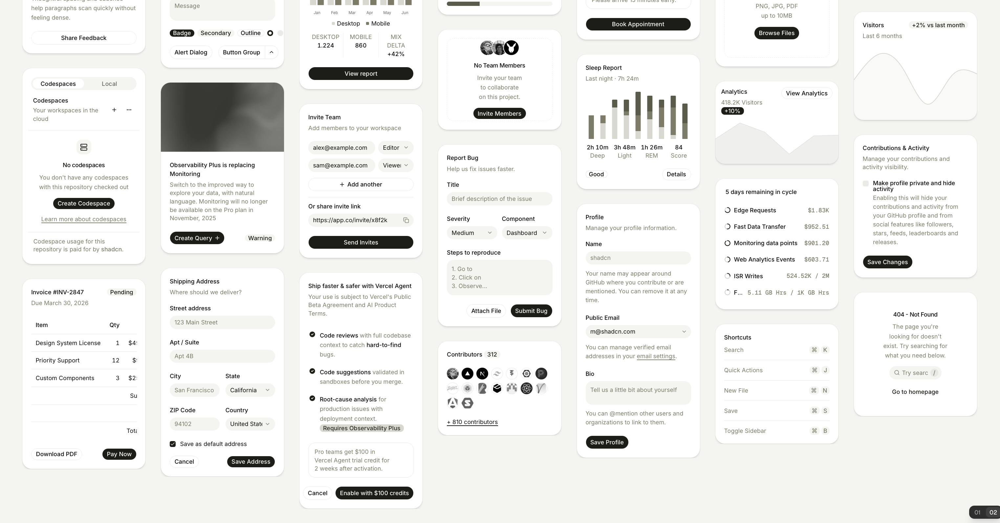
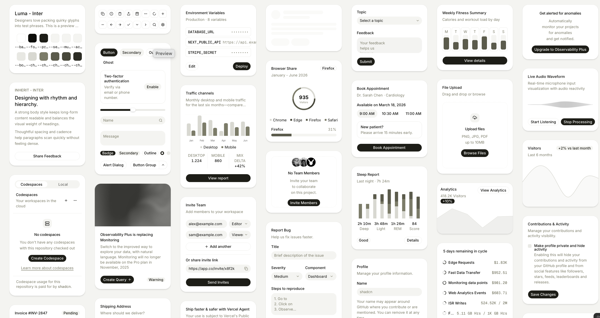
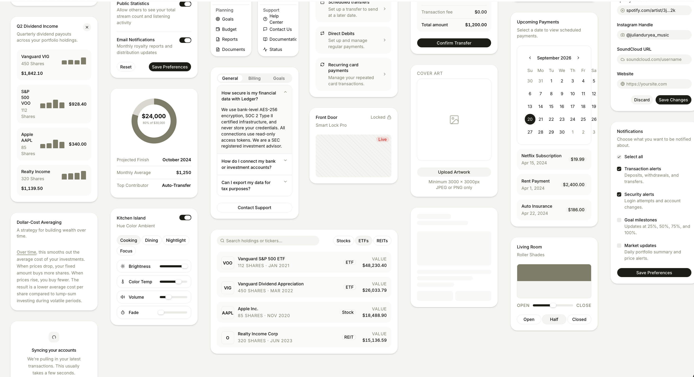
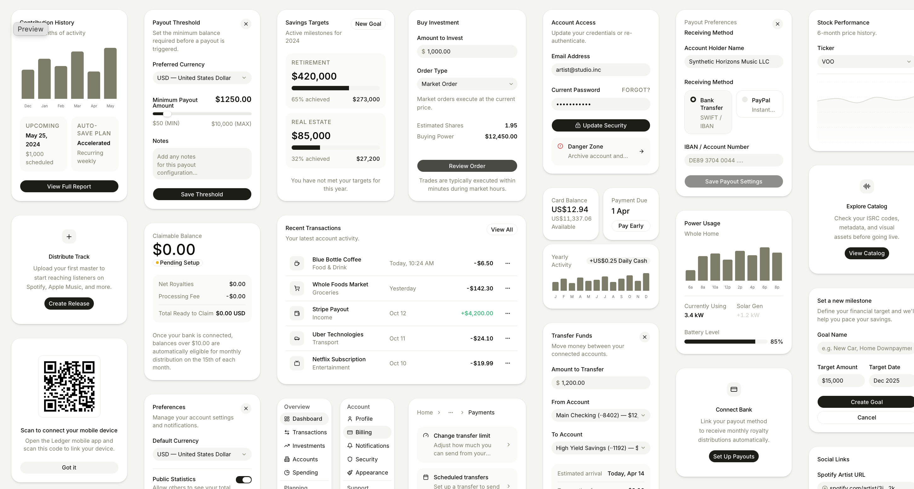

# Visuelle Vorgaben: Sporttag

Stand: 20.09.2026 · Farbpalette und vier vom Nutzer gelieferte Referenzbilder

Dieses Dokument ist Pflichtlektüre für UI- und Designarbeit. Es ergänzt die [Frontend-Architektur](frontend-architektur.md). Die Bilder sind dauerhaft im Repository gespeichert; temporäre Clipboard-Pfade werden zur weiteren Arbeit nicht benötigt.

## Verbindliche Farbpalette

| Token | Wert | Beabsichtigte Verwendung |
|---|---|---|
| Primary | `#556B2F` | Olivgrün für primäre Aktionen, Auswahl und Markenakzente |
| Secondary | `#A9B58A` | Zurückhaltendes Salbeigrün für ergänzende Flächen und Gruppen |
| Accent | `#C59A4A` | Warmes Gold für sparsame Hervorhebungen |
| Muted | `#E3E5D8` | Helle neutrale Grünnuance für ruhige Hintergründe und untergeordnete Flächen |

Die vier Hexwerte sind ausdrücklich vorgegeben. Sie stehen zusätzlich maschinenlesbar in [palette.json](design-references/palette.json). Weitere Farben, Schriftfamilien und konkrete Größen sind noch keine bestätigten Design-Tokens.

Für weiße Karten, warmen Seitenhintergrund, dunklen Text, Trennlinien und Statusanzeigen passende ergänzende Tokens ableiten. `Muted` bezeichnet eine helle Farbe und ist nicht automatisch die Farbe für lesbaren Hilfstext. Text-/Hintergrundkombinationen bei Umsetzung auf Kontrast prüfen. Gold und Salbeigrün nicht ungeprüft mit weißer kleiner Schrift kombinieren. Fehler, Offline-Zustand und Synchronisationsstatus behalten eindeutige semantische Kennzeichnung durch Text und Symbol. Dark-Mode-Flächen bei Umsetzung separat entwickeln; die Screenshots zeigen die helle Richtung.

## Charakter und Layout

Die Referenzen zeigen eine ruhige, warme, reduzierte Oberfläche mit weißen, deutlich abgerundeten Karten auf sehr hellem, leicht warmem Grund. Feine Konturen und weiche, geringe Schatten trennen Ebenen. Große Freiräume zwischen Karten stehen einer kompakten, klar gegliederten Anordnung innerhalb der Karten gegenüber.

Die Sammlung nutzt mehrere Spalten und unterschiedlich hohe Karten. Das ist Inspiration für modulare Backoffice-Flächen; ein dichtes Masonry-Raster ist keine Pflicht für jeden Screen. Im Stationsbetrieb werden Karten nach Arbeitsfolge und Wichtigkeit untereinander angeordnet. Desktop-Flächen dürfen mehrspaltig sein, ohne die Lesereihenfolge oder Tastaturbedienung zu verlieren.

Typische Kartenhierarchie: kurzer Titel → zurückhaltende Beschreibung → Inhalt oder Eingaben → passende Aktion. Kennzahlen dürfen deutlich größer sein; übrige Überschriften bleiben eher kompakt statt plakativ. Inhalte werden linksbündig geführt, Leerzustände teilweise zentriert. Kurze Beschriftungen, dünne Trennlinien und gruppierte Unterflächen machen Zusammenhänge erkennbar.

## Komponentenmerkmale aus den Screenshots

- **Karten:** große weiche Ecken, dezenter Rand/Schatten, konsistenter Innenabstand; verschachtelte Inhalte liegen häufig auf einer leicht getönten Fläche.
- **Buttons:** häufig pillenförmig, primäre Aktionen dunkel gefüllt, sekundäre Aktionen hell oder fein umrandet; Breite folgt der Funktion, bis hin zu voller Kartenbreite. Für das Projekt übernimmt Primary-Oliv die Markenrolle der dunklen Referenzbuttons.
- **Eingaben:** ruhige helle Füllung, abgerundete Kontur, sichtbare Labels oberhalb, optionale Icons oder angehängte Aktionen. Mehrzeilige Eingaben behalten dieselbe Formsprache.
- **Badges und Chips:** kompakte runde Formen; gefüllte, helle und Outline-Varianten mit zurückhaltender Gewichtung.
- **Segmentierte Auswahl:** helle gemeinsame Spur, hervorgehobenes ausgewähltes Segment; native Navigation weiterhin nach Architekturvorgabe.
- **Listen:** wiederkehrende Zeilen mit kleinem Iconbereich, Titel/Untertitel und rechts ausgerichtetem Wert oder Aktion. Gruppierung über Abstände, feine Linien oder getönte Unterkarten.
- **Formulare:** klare Reihenfolge und kurze Hilfstexte, nebeneinanderliegende Felder nur bei ausreichend Platz; eindeutige Hauptaktion.
- **Icons:** einfache, leichte Symbole, einheitliche optische Größe; kleine Iconbuttons wirken rund oder weich rechteckig.
- **Leer-/Ladezustände:** kleines Symbol, kurzer Titel, knappe Erläuterung und gegebenenfalls eine Aktion; Skeletons folgen den tatsächlichen Inhaltsformen.
- **Diagramme:** zurückhaltende Balken, Linien, Fortschrittsanzeigen und Ringdiagramme mit wenigen Farben. Nur einsetzen, wenn sie fachlich helfen; die Sporttag-App benötigt kein Finanzdashboard.

Die winzigen Bedienelemente der verkleinerten Referenzbilder sind keine Größenangabe. Mobile Touchflächen, Schriftvergrößerung, Fokusdarstellung und Lesbarkeit draußen müssen bei der Umsetzung berücksichtigt werden. Konkrete Radien, Abstände und Schriftgrößen werden als konsistentes Tokensystem ausgearbeitet, nicht aus Screenshot-Pixeln übernommen.

## Bezug zur Technik und zu Liquid Glass

Gewählte Komponentenbasis ist jetzt **gluestack-ui mit NativeWind**. Die vorherige NativeWindUI-Festlegung wird damit ersetzt. Vor der Integration bleibt der vereinbarte kleine Kompatibilitätstest auf iOS, Android und Expo Web erforderlich; eine konkrete Versionskombination ist noch nicht als geprüft festgelegt.

Auf iOS bleibt echtes natives Liquid Glass für passende Navigation und schwebende Bedienelemente vorgesehen. Die weißen Inhaltskarten der Referenzen werden nicht pauschal zu Glasflächen. Markenfarben, Hierarchie und Komponentencharakter bleiben über Plattformen konsistent.

Beschriftungen wie „shadcn“, Finanz-/Medizinbeispiele, QR-Codes und Produktnamen in den Screenshots sind Beispielinhalt. Sie führen keine neuen App-Funktionen, Bibliotheken oder Anweisungen ein. Die Screenshots bestimmen Stil und Komponentenabsicht; sie sind wie Figma-Entwürfe keine pixelgenauen Implementierungsvorgaben.

## Gesicherte Originalreferenzen

### 1. Karten, Formulare und Listen

### 2. Komponentenübersicht und Hierarchie

### 3. Gruppierte Inhalte und Bedienelemente

### 4. Dashboard-Anordnung, Kennzahlen und Aktionen

[sources.json](design-references/sources.json) dokumentiert Originaldateinamen und SHA-256-Prüfsummen. Die Bilder wurden unverändert kopiert.
